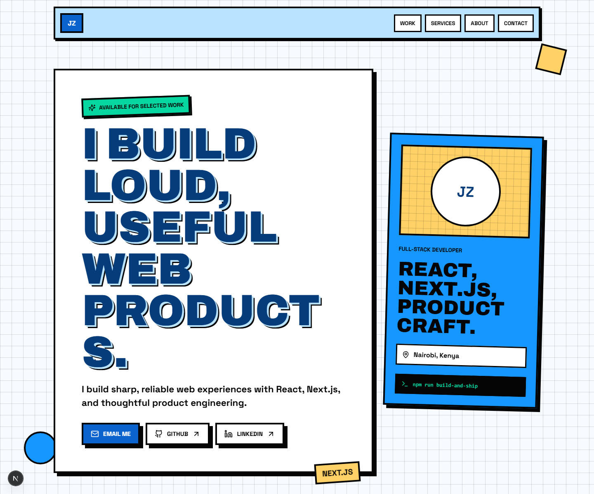

# Jonzelle Otieno Portfolio

A neobrutalist developer portfolio for **Jonzelle Otieno**: full-stack developer, product-minded builder, and maker of sharp web products for dashboards, workflows, and role-based tools.

Live site: [jonzelleotieno.vercel.app](https://jonzelleotieno.vercel.app)



## What This Is

This repo powers a portfolio built with Next.js, React, TypeScript, and a custom CSS system. It presents selected work, service offerings, and a detailed about page with a playful but practical interface.

The portfolio highlights:

- **KaziFlow**: a production-ready team operations dashboard for workspaces, projects, tasks, teams, Kanban, and calendar views.
- **Shenanigans**: a role-based enterprise management platform for Managing Directors, Project Managers, and Employees.
- **Services**: front-end systems, Next.js apps, design implementation, API integration, performance tuning, and technical cleanup.

## Tech Stack

- Next.js 16
- React 19
- TypeScript
- CSS Modules via global app stylesheet
- Lucide React icons
- Playwright for visual/smoke checks
- Vercel deployment

## Features

- Responsive neobrutalist interface
- Interactive project showcase with screenshot carousel
- Authenticated project screenshots for KaziFlow and demo screenshots for Shenanigans
- Reusable project, service, and timeline components
- Accessible links, buttons, labels, and image alt text
- Production deployment on Vercel

## Project Structure

```text
app/
  about/
  services/
  work/
  components/
  data/
  globals.css
public/
  projects/
  social/
scripts/
  capture-kaziflow-auth.cjs
  capture-feature-screenshots.mjs
```

## Getting Started

Install dependencies:

```bash
npm install
```

Start the development server:

```bash
npm run dev
```

Open:

```text
http://localhost:3000
```

## Available Scripts

```bash
npm run dev
npm run lint
npx tsc --noEmit
npm run build
npm run start
```

## Updating Portfolio Content

Most portfolio content lives in:

```text
app/data/portfolio.ts
```

Edit this file to add or update:

- Profile details
- Projects
- Project screenshots
- Services
- Timeline entries

Reusable rendering components live in:

```text
app/components/
```

## Capturing Project Screenshots

KaziFlow authenticated screenshots can be refreshed with:

```bash
node scripts/capture-kaziflow-auth.cjs
```

The current first KaziFlow dashboard image is:

```text
public/projects/kaziflow-dashboard-human.png
```

## Deployment

The site is deployed on Vercel.

Production URL:

```text
https://jonzelleotieno.vercel.app
```

Manual production deploy:

```bash
vercel --prod --yes
```

## Contact

- GitHub: [@JzTheBvckster](https://github.com/JzTheBvckster)
- LinkedIn: [Jonzelle Otieno](https://www.linkedin.com/in/jonzelle-otieno-056a50385)
- Email: [jonzelleotieno31@gmail.com](mailto:jonzelleotieno31@gmail.com)

## License

This is a personal portfolio. All rights reserved unless a separate license is added.
